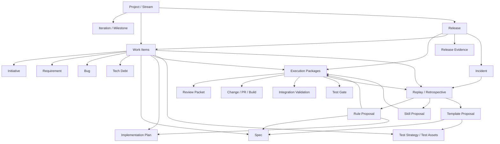
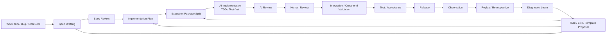
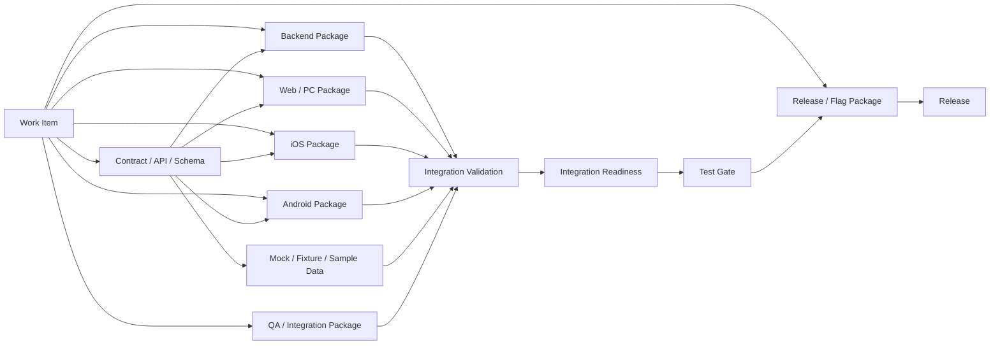
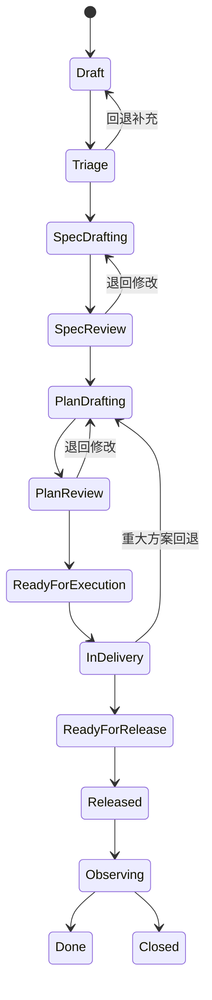
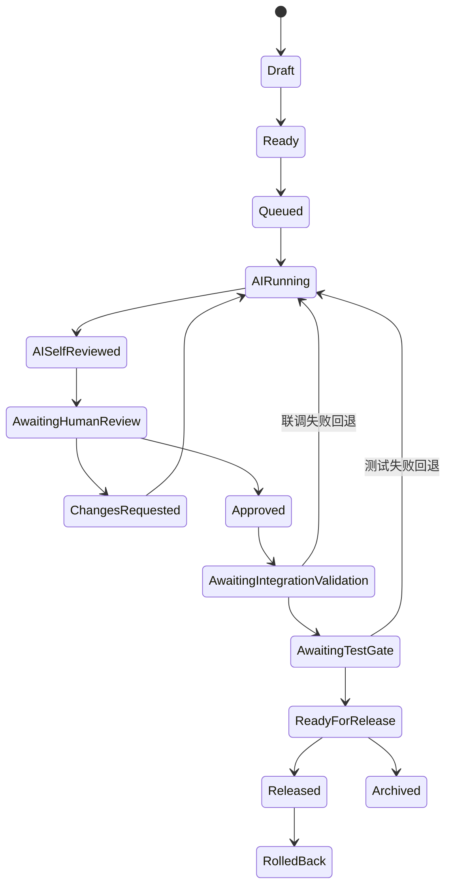
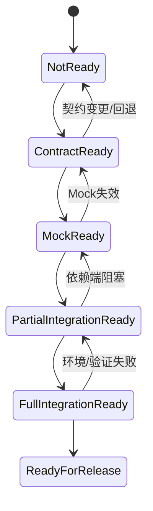

# PRD：AI-native 研发执行与进化系统

## 1. 文档信息

- 文档名称：AI-native 研发执行与进化系统 PRD
- 版本：v1.1
- 文档状态：Draft
- 产品阶段：概念定义 / 正式立项前
- 面向对象：产品、研发、测试、架构、管理者、AI 平台团队

---

## 2. 产品概述

### 2.1 产品名称
AI-native 研发执行与进化系统

### 2.2 一句话定义
一个面向 **多角色协作、默认以 AI 为主要实现者、人工主要负责决策、审查与验收** 的软件研发操作系统：以 **业务对象驱动协作**，以 **Execution Package 驱动研发执行**，通过 **交付主线 + 进化主线** 的双循环闭环，持续提升研发效率、质量与组织学习能力。

### 2.3 产品定位
本产品不是传统项目管理工具的 AI 插件，也不是单纯的 AI coding 工作台，而是一套完整的软件研发生产系统，目标是将 AI 作为正式执行者，将人从低价值的搬运与补位工作中解放出来，聚焦于目标定义、边界判断、架构审查、风险控制、质量把关与系统优化。

它面向的不是单一开发者角色，而是完整的研发参与方，包括：需求方、产品、架构、开发、Reviewer、QA、发布负责人、管理者以及 AI Agents。

产品在对象模型上采用分层设计：
- **容器层对象**：Project / Stream / Iteration / Milestone，用于承载团队、时间范围、权限边界与阶段性目标。
- **跨角色统一主对象**：Work Item 体系，用于承载跨职能协作、状态推进与全链路追踪。Work Item 包括 Initiative、Requirement、Bug、Tech Debt 等类型。
- **研发执行主对象**：Execution Package，作为 AI 实施、Review、测试、发布控制与执行编排的基本单元。
- **交付编排对象**：Release，用于聚合一批可交付变更、测试证据、灰度策略、风险与回滚方案。

因此，本产品既是一个面向全角色的研发协作与治理系统，也是一个以 Execution Package 为核心执行原语的 AI-native 研发执行平台。

### 2.4 核心价值
1. 将模糊需求转化为可执行、可审查、可追溯的交付链路。
2. 将 AI 从“辅助工具”提升为“正式执行角色”。
3. 将 Review、测试、缺陷与发布纳入统一闭环，而不是割裂管理。
4. 将全量研发轨迹沉淀为组织学习资产，实现流程与系统的持续进化。
5. 形成“执行 + 进化”双主线闭环，使每一次交付都能反哺下一次交付。

---

## 3. 背景与问题定义

### 3.1 背景
团队已经进入 AI-native 研发阶段，代码实现工作大量由 AI 完成，人工更多承担以下职责：
- 定义目标与边界
- 评审 Spec 与 Plan
- 审查 AI 产出
- 进行测试策略设计与质量把关
- 决定发布、回滚与流程优化

传统的项目管理与研发协作流程，主要建立在“人类开发者是主要实现者”的前提之上，因此在 AI-native 团队中出现明显不匹配。

### 3.2 当前主要问题
1. **传统需求 → Task 流程过于粗糙**
   - 需求直接拆成任务，缺少稳定的 Spec 和 Plan 层
   - 人工在 Review 阶段被迫补做前置思考

2. **跨角色协作对象与研发执行对象混杂**
   - 需求方、产品、管理者、QA、发布负责人关注的并不是同一类对象
   - 若直接以 Task 或代码变更作为统一对象，会导致产品难以覆盖全角色视角
   - 若直接以高层需求对象驱动执行，又会导致 AI 执行颗粒度不足、边界不清晰

3. **AI 实施缺少标准执行包**
   - AI 往往直接基于一句话需求或简略任务标题工作
   - 结果难以控制边界，难以并行、难以追责、难以复盘

4. **测试与 QA 介入过晚**
   - 测试策略未前置进入 Spec 阶段
   - AI 实施若未采用 TDD / Test-first 范式，代码质量和可维护性容易失控
   - 质量问题经常在 Review 或上线后才暴露

5. **Review 负担不合理**
   - Reviewer 需要先建立上下文，再做判断
   - 人工时间被大量消耗在找信息，而不是做关键决策

6. **研发过程缺乏全链路可追溯能力**
   - 无法完整回放需求、Spec、Plan、执行、Review、测试、发布与事故之间的因果链条
   - 组织经验无法系统化沉淀

7. **缺乏面向 AI-native 团队的学习与进化机制**
   - 每次返工、Bug、事故和高质量实践没有被有效转化为规则、模板与技能

8. **多端交付与联调成本高**
   - 后端、Web / PC 端、App 端、测试环境与发布窗口之间经常存在依赖错位
   - 联调问题往往在实现完成后才暴露，本质上是契约、环境、排期与依赖管理问题
   - 缺少跨端依赖、联调就绪度、关键路径与环境状态的系统化管理

### 3.3 目标问题
本产品要解决的核心问题是：

> 如何为一个默认以 AI 实施、人工主要负责审查与判断，并允许在必要时人工接管的研发团队，构建一套可执行、可治理、可追溯、可进化的软件研发系统？

---

## 4. 产品目标与非目标

### 4.1 产品目标
1. 建立适用于 AI-native 团队的研发流程与产品模型。
2. 建立由容器层、业务对象层、执行层、交付编排层组成的分层对象体系。
3. 将需求交付过程拆分为结构化、可审查、可自动化推进的阶段。
4. 让 AI 在 Spec、Plan、执行、Review、测试、复盘等多个阶段成为原生参与者。
5. 让测试、质量与风险控制前移，而不是后置补救。
6. 让 AI 默认以 TDD / Test-first 范式进行实现，提高代码质量与可验证性。
7. 记录并回放全量研发轨迹，支持日常复盘与事故复盘。
8. 将复盘结论持续沉淀为模板、规则、技能与流程优化建议。
9. 形成执行与进化相互驱动的系统级闭环。

### 4.2 非目标
1. 不以“代码编辑器”或“IDE 替代品”为主要目标。
2. 不以简单工时监控、机械规则打分或粗糙排行榜作为产品核心。
3. 不将产品定义为简单的 Jira/飞书项目替代品。
4. 不把 AI 仅作为聊天入口或问答助手。

---

## 5. 用户角色与职责

### 5.1 角色定义

#### 5.1.1 Work Item Drivers（按类型拆分）
Work Item 不是单一职责角色，而是 Initiative、Requirement、Bug、Tech Debt 等不同信息类型的统一抽象。系统应按 Work Item 类型和当前阶段分配推进责任，而不是暴露一个粗粒度的单一 Owner 工作台。

- **Initiative Driver**：负责业务目标、范围边界、里程碑和价值排序。
- **Requirement Driver**：负责需求背景、成功标准、验收范围和 Spec 推进。
- **Bug Driver**：负责影响范围、复现信息、修复优先级、验证路径和回归闭环。
- **Tech Debt Driver**：负责技术风险、偿还策略、影响面和工程健康收益。
- **Cross-item Coordinator**：当一个 Work Item 横跨多个端、多个包或多个 Release 时，负责跨对象依赖与推进节奏。

#### 5.1.2 Spec Approver
通常为架构师、技术负责人、模块 Owner。负责审批 Spec 的正确性、边界清晰度与方案合理性。

#### 5.1.3 Execution Owner
对某个执行包的实现结果负责，监督 AI 执行，协调相关人员推进落地。

#### 5.1.4 Reviewer
对 AI 产出的实现进行结构化审查，关注风险、质量与一致性。

#### 5.1.5 QA / Test Owner
前置参与测试策略设计，负责质量门禁、探索性测试、高风险路径设计与测试资产治理。

#### 5.1.6 Release Owner
负责上线决策、发布编排、灰度与回滚控制。

#### 5.1.7 Manager
关注项目健康度、流程瓶颈、质量趋势、组织负载、系统效率与人员能力发展，不以低价值工作量为核心指标，但可基于系统沉淀的高质量过程数据、交付结果、Review 质量、风险控制与协作表现，将其作为绩效评估的重要参考依据。

#### 5.1.8 AI Agent
系统中的正式执行角色，可承担 Spec 草拟、Plan 生成、代码实现、Review、自审、测试生成、Bug 分诊、复盘与建议生成等职责。

### 5.2 角色转变原则
- 人从“主要实现者”转变为“目标定义者、审查者、风险控制者、质量把关者”。
- AI 从“辅助工具”转变为“正式执行角色”。
- QA 从“后置测试执行者”转变为“质量架构师与测试策略负责人”。

---

## 6. 核心设计原则

1. **Layered Object Model**：产品必须采用分层对象模型，以 Project / Stream 等容器层对象承载组织上下文，以 Work Item 体系承载跨角色业务协作，以 Execution Package 承载研发执行，以 Release 承载交付编排。
2. **Execution Package for Delivery**：Execution Package 是研发执行层的一等公民，是 AI 实施、Review、测试与发布控制的基本单元。
3. **Spec-first**：没有 Spec，不进入正式执行。
4. **Plan-before-Execution**：Plan 是 Spec 到执行的桥梁，不允许 Work Item 直接生成执行任务。
5. **TDD-by-default for AI**：AI 默认采用 TDD / Test-first 范式进行实现；对多端联调、契约定义、探索性 UI、迁移与外部依赖场景，可采用 Contract-first 或 Validation-first 的等价质量约束路径；没有测试策略和验证路径的实现不可视为高质量交付。
6. **Review is Structured Judgment**：Review 不只是看代码，而是对完整上下文下的实现结果做判断。
7. **Quality Shift-left**：测试策略与 QA 在 Spec 阶段前置介入。
8. **Everything Traceable**：所有关键过程、决策、轨迹、AI 交互均可追踪、可回放。
9. **Learning Loop Built-in**：复盘与进化不是附属模块，而是产品主线和主要卖点之一。
10. **Human-in-the-loop at High-value Nodes**：人只在高价值节点参与，避免被系统迫使做低价值重复劳动。
11. **Execution and Evolution in Closed Loop**：每次执行都生成可学习资产，每次学习都必须回灌未来执行。
12. **Contract-first Cross-end Coordination**：多端项目默认采用 Contract-first / Mock-first 协作范式，尽可能将联调问题前移到 Spec、Plan 与验证阶段。
13. **Human Override in Exceptional Cases**：系统默认以 AI 为主要执行者，但在紧急事故、AI 连续失败、高风险合规场景或特殊外部依赖场景下，应支持人工接管 / Manual Path，并完整纳入追踪、审计与复盘。

---

## 7. 整体流程模型

### 7.1 双主线闭环
- **交付主线**：Work Item → Spec → Implementation Plan → Execution Package → AI Implementation → AI Review → Human Review → Integration / Cross-end Validation → Test / Acceptance → Release → Observation
- **进化主线**：Trace → Replay → Diagnose → Learn → Codify → Improve

两条主线并非前后割裂，而是形成闭环：交付过程中持续生成可追溯事件与轨迹；进化系统对轨迹进行日常复盘、阶段复盘与事故复盘；复盘产出的规则、模板、技能、策略和流程更新，再回灌到下一轮交付中。

### 7.2 流程关系说明
- Project / Stream / Iteration 用于承载团队、阶段、资源与时间边界。
- Work Item 是跨角色协作与治理的主对象，包括 Initiative、Requirement、Bug、Tech Debt 等类型。
- Spec 定义做什么、边界是什么、怎么验收。
- Implementation Plan 定义准备如何做、怎么分步、怎么测、怎么回滚。
- Execution Package 是真正交给 AI 和执行责任人的工作单元，也是研发执行层的基本单元。
- Release 是交付编排对象，用于聚合多个 Work Item 与 Execution Package 的交付结果、测试证据与发布策略。
- Review、测试、发布与观测共同构成交付闭环。
- Trace 与 Retrospective 负责从过程沉淀经验，并反哺未来交付。

---

## 8. 核心对象模型

### 8.1 Project / Stream
表示团队、业务线、项目流或长期工作域的容器层对象。

关键字段包括：
- 名称
- 类型
- 负责人
- 所属团队
- 时间范围
- 权限边界
- 关联 Iteration / Milestone

### 8.2 Work Item
表示跨角色统一主对象的抽象类型，用于承载从目标提出到交付完成的业务协作主线。

说明：
- Work Item 是多数角色默认观察、推进与治理的主对象。
- Work Item 支持多种类型，包括 Initiative、Requirement、Bug、Tech Debt 等。
- Requirement 与 Bug 不再是两套完全割裂的体系，Bug 视为一种特殊 Work Item，以便统一追踪、测试、复盘与规则沉淀。

关键字段包括：
- 类型
- 背景与目标
- 优先级
- 业务价值
- 风险等级
- 状态
- Owner
- 成功标准
- 所属 Project / Stream
- 关联 Spec / Plan / Release

### 8.3 Spec
表示需求的正式定义文档，是执行和验收的上游依据。

关键字段包括：
- 背景
- Scope / Out of Scope
- 用户故事
- 关键流程
- 接口与数据变更
- 验收标准
- 测试策略摘要
- 风险与未决问题
- 版本历史
- Approver

### 8.4 Implementation Plan
表示针对已批准 Spec 的实施方案。

关键字段包括：
- 方案概述
- 拆分策略
- 依赖顺序
- 测试矩阵
- 发布策略
- 回滚方案
- Reviewer / QA 建议
- 风险与缓解措施

### 8.5 Execution Package
本产品中的研发执行主对象，表示可被 AI 实施、可被人审查、可被系统追踪的执行单元。

说明：
- Execution Package 不是面向所有角色的统一主对象。
- 它是执行层的一等公民，服务于 AI 编排、代码实现、Review、测试、发布控制与执行复盘。
- 对于产品、需求方、管理者、发布负责人等角色，系统仍应以 Work Item / Release 等业务对象为主要观察对象。

关键字段包括：
- 对应 Work Item / Spec / Plan
- 执行目标
- 涉及模块与边界
- 允许修改范围
- 必须通过的检查与测试
- 风险提示
- Owner / Reviewer / QA Owner
- 端类型 / Surface Type（backend / web / ios / android / data / infra / qa / release 等）
- 所属 repo / deploy unit
- 契约版本 / contract version
- 联调前置条件
- 依赖 Execution Packages
- 环境需求
- 联调就绪度 / integration readiness
- 完成定义
- 状态

### 8.6 Review Packet
表示一个供 Reviewer 进行判断的审查包。

关键字段包括：
- 改动摘要
- 对应 Spec / Plan 节点
- 关键 Diff
- AI 自审结果
- 独立 AI Reviewer 结论
- 测试映射
- 风险点
- 需要人工决策的问题

### 8.7 Test Strategy / Test Asset
表示测试策略、测试计划、测试用例、测试执行、回归资产的集合。

### 8.8 Release
表示交付编排对象，用于聚合一批可发布变更、测试证据、灰度策略、风险与回滚方案。

关键字段包括：
- 发布范围
- 关联 Work Items
- 关联 Execution Packages
- 测试与验证证据
- 灰度策略
- 回滚方案
- 风险摘要
- 发布状态

### 8.9 Incident
表示线上事故或异常事件对象，支持与 Work Item、Execution Package、Release 的全链路回放。

关键字段包括：
- 事故等级
- 影响范围
- 发现时间
- 根因摘要
- 关联 Release / Work Item / Package
- 修复与回滚动作
- 复盘链接

### 8.10 Contract
表示多端协作中的 API / Schema / Event / State Contract 对象，是 Contract-first / Mock-first 协作的核心对象。

关键字段包括：
- Contract 类型
- 版本
- 兼容性要求
- Provider / Consumer
- 示例数据 / Sample Payload
- Mock / Fixture 资产
- 冻结状态
- 审批记录

### 8.11 Environment / Artifact / Version
表示环境、构建产物与版本对象，用于支撑联调 readiness、发布编排、回滚与问题定位。

关键字段包括：
- 环境类型（dev / test / staging / prod）
- Artifact / Build 标识
- 版本号
- 所属端 / deploy unit
- 可用状态
- 发布时间
- 回滚信息

### 8.12 Event / Trace / Decision / Insight / Rule Proposal
用于支撑复盘与系统进化。

### 8.13 对象关系与约束
系统中的核心对象应满足以下关系与约束：
- Project / Stream 作为容器层对象，承载多个 Work Item、Iteration、Milestone 与 Release。
- Work Item 是跨角色协作的主对象，一个 Work Item 可关联一份或多份 Spec 与 Implementation Plan。
- 一个 Work Item 可拆分为多个 Execution Package；多个 Execution Package 可存在依赖、阻塞、串行或并行关系。
- Release 不是普通 Work Item，而是交付编排对象，用于聚合多个 Work Item 与 Execution Package 的发布结果、测试证据与风险信息。
- Incident 可回链到 Release、Work Item、Execution Package 及其相关轨迹，用于全链路复盘。
- Event / Trace 记录对象之间的时间序列关系、因果关系与关键决策证据。
- 系统必须支持从任一核心对象出发，双向追溯其上游来源、下游结果及跨端依赖关系。

---

## 9. 核心用户故事

### 9.1 新功能需求
作为 Requirement Driver，我提交一个新功能 Work Item 后，希望系统自动生成 Work Item Brief 和 Spec 草案，并在 Spec 通过后进一步生成 Implementation Plan、Execution Packages、测试策略和执行建议，使整个交付链路结构化推进。

### 9.2 缺陷修复
作为团队成员，当线上出现 Bug 时，我希望系统能自动完成初步分诊、关联可能影响的 Work Item / 改动 / 测试资产，并生成修复路径、验证方案和复盘入口，帮助我们快速修复并沉淀经验。

### 9.3 日常 Review
作为 Reviewer，我希望系统在我审查某次 AI 产出前，已经准备好完整上下文、关键 Diff、风险提示与测试映射，使我能把时间放在判断和决策上。

### 9.4 QA 质量控制
作为 QA，我希望在 Spec 阶段就参与质量设计，定义测试策略、风险场景和自动化门禁，并在后续执行过程中跟踪测试覆盖、回归风险与质量健康度。

### 9.5 每日复盘
作为系统使用者，我希望每天收到一份自动生成的 Daily Replay / Coaching Brief，帮助我了解今天的产出、优点、瓶颈与提效建议。

### 9.6 事故复盘
作为团队负责人，我希望在 Bug 或事故发生后，可以一键查看从 Work Item 到 Release 的完整链路，识别问题来源、漏检环节与流程优化机会。

---

## 10. 产品模块定义

### 10.1 Work Item Cockpit
用于管理需求、缺陷、技术债与其他工作入口。

核心能力：
- Work Item 录入
- 智能归一化
- 初步分类与优先级建议
- 风险判断
- Work Item Brief 生成
- 进入 Spec 阶段前的分诊与审批

### 10.2 Spec Studio
用于起草、审阅和批准 Spec。

核心能力：
- AI 自动生成 Spec 草案
- 多角色协作编辑
- 测试策略与风险建议
- 版本管理
- 批注与审批
- Scope / 验收标准 / 风险项结构化呈现

### 10.3 Plan & Execution Builder
用于将已批准的 Spec 转化为可执行方案与执行包。

核心能力：
- 自动生成 Implementation Plan
- 自动生成测试矩阵
- 自动拆分 Execution Packages
- 并行/串行依赖判断
- Owner / Reviewer / QA 推荐
- 执行图可视化
- 将高层业务对象映射为执行层对象，并保持双向追溯
- 基于拆分规则校验 Execution Package 是否满足独立验证、独立审查、独立回滚、独立复盘要求

### 10.4 Execution Console
用于管理 AI 执行过程。

核心能力：
- Execution Package 触发
- AI Agent 调度
- 执行状态跟踪
- 执行上下文管理
- 中间结果记录
- 执行失败重试与升级

### 10.5 Review Center
用于统一管理 Review。

核心能力：
- Review Packet 自动生成
- AI 自审与独立 AI Review
- 人工审查入口
- 结构化风险提示
- Review 阻塞与 SLA 跟踪
- 审查结论沉淀

### 10.6 Quality & Test Center
用于定义、管理与执行测试策略和测试资产。

核心能力：
- Test Strategy 管理
- 测试用例/计划/执行记录
- 自动生成测试资产
- 测试 Gap 识别
- 回归范围建议
- 质量门禁配置
- 追溯 Work Item → Test → Bug 链路

### 10.7 Release & Risk Radar
用于发布前决策与发布后观测。

核心能力：
- 发布候选管理
- 风险汇总
- 灰度/回滚建议
- 发布清单
- 发布后指标观测
- 问题回链到 Work Item、Release 与改动

### 10.8 Retrospective & Evolution Center
用于日常复盘、事故复盘、系统学习与绩效参考洞察。

核心能力：
- 每日复盘
- 项目/迭代复盘
- 缺陷/事故全链路复盘
- 根因分析
- 流程问题识别
- Rule / Template / Skill 提案生成
- 绩效参考洞察与成长建议

### 10.9 Process Replay
用于按时间线回放任意 Work Item、Bug、项目、版本或事故的完整过程。

核心能力：
- Timeline 回放
- Trace 浏览
- 决策节点查看
- AI/Human 行为轨迹查看
- Executive / Engineering / Quality 视角切换

### 10.10 Cross-end Delivery & Integration Hub
用于管理多端交付协同、联调准备度、环境依赖与关键路径。

核心能力：
- 多端 Work Item / Execution Package 映射
- Contract / Mock / Fixture 管理
- 联调 readiness 视图
- 跨端依赖图与关键路径分析
- 环境状态与联调 blocker 管理
- 联调检查表与跨端验证记录
- 版本窗口、灰度窗口与发版协同

### 10.11 Product Lanes / Workbench Lanes
用于按 Work Item 类型、审批责任、执行责任、质量责任、发布责任和管理视角提供默认工作入口、优先级队列与待办视图。Product Lanes 不是历史的角色工作台别名，也不以单一 Owner 粒度组织信息。

核心能力：
- Requirements Lane：需求池、待确认 Brief、待推进 Spec、待补充成功标准
- Bugs Lane：缺陷分诊、影响范围、修复路径、回归验证和复盘入口
- Tech Debt Lane：技术债识别、偿还优先级、影响面和工程健康证据
- Initiatives Lane：业务目标、范围拆解、里程碑、跨 Work Item 聚合
- Spec Approver Lane：待评审 Spec、风险需求、测试策略缺口
- Execution Owner Lane：Execution Packages、依赖、blocker、联调 readiness
- Reviewer Lane：待审 Review Packet、风险优先队列、超 SLA 审查
- QA / Test Owner Lane：测试策略、质量门禁、联调验证、回归风险
- Release Owner Lane：候选 Release、发布风险、灰度与回滚决策
- Manager Lane：项目健康度、流程瓶颈、复盘洞察、绩效参考摘要

---

## 11. 详细流程要求

### 11.1 Work Item Intake 阶段
要求：
- 系统支持从手动输入、外部反馈、Bug、监控告警等渠道创建 Work Item。
- 系统应自动生成 Work Item Brief。
- Work Item 必须经过初步分类、优先级与风险评估。
- Work Item 在进入 Spec 阶段前，需要完成 Owner 指定与基本成功标准确认。

### 11.2 Spec 阶段
要求：
- 系统应支持 AI 自动生成 Spec 草案。
- Spec 必须支持多角色协作与审批。
- Spec 应包含背景、目标、Scope、关键流程、接口变化、验收标准、测试策略摘要、风险与未决问题。
- 高风险 Work Item 的 Spec 必须引入 QA 参与测试方案设计。

### 11.3 Implementation Plan 阶段
要求：
- Spec 获批后，系统应自动生成 Implementation Plan 草案。
- Implementation Plan 应包含拆分策略、依赖顺序、测试矩阵、发布与回滚方案、风险缓解措施。
- 拆分策略必须说明 Execution Package 的边界依据，包括独立验证、独立审查、独立回滚与独立复盘能力。
- Plan 获批后方可进入 Execution Package 生成。

### 11.4 Execution Package 阶段
要求：
- 每个执行单元必须以 Execution Package 为单位进行调度和追踪。
- Execution Package 必须明确修改边界、成功条件、测试要求与责任人。
- Execution Package 的拆分原则应基于“独立验证、独立审查、独立回滚、独立复盘”，而不是按岗位或粗糙任务粒度拆分。
- 当一个执行单元同时包含多个主要风险域、多个主要验证路径、多个主要发布语义或需要过大上下文时，系统应提示强制拆包。
- 系统应支持多个 Package 的依赖关系管理。
- 系统应支持基于角色、模块经验、历史协作与负载情况推荐 Owner/Reviewer/QA。
- 系统必须保证 Execution Package 与其所属的 Work Item / Release 对象保持强关联，便于跨角色查看和复盘。

### 11.5 AI 实施阶段
要求：
- 系统应允许为一个 Execution Package 绑定一个或多个 AI Agent。
- 系统应记录 AI 使用的上下文、输入、关键中间输出与执行结果。
- AI 产出必须关联回 Execution Package、Spec 和 Plan。
- AI 默认应以 TDD / Test-first 模式进行实现，优先生成或确认测试，再进行代码改动；对多端联调、契约定义、探索性 UI、迁移与外部依赖场景，可采用 Contract-first 或 Validation-first 的等价质量路径。
- 没有明确测试策略、验证路径或回归要求的 Package，不应进入正式 AI 实施。
- 当出现紧急事故、AI 连续失败、高风险合规约束或特殊外部依赖时，系统应支持人工接管 / Manual Path，并完整记录接管原因、执行过程与审计证据。
- AI 实施结束后，系统需自动进入 Review Packet 生成流程。

### 11.6 Review 阶段
要求：
- 系统应先执行 AI 自审，再执行独立 AI Review。
- Review Packet 必须整合改动摘要、Spec 对应关系、测试映射与风险点。
- 人工 Reviewer 应在结构化上下文中完成判断。
- Review 结果必须可追踪，并可反哺 Rule / Skill / Template。

### 11.7 Integration / Cross-end Validation 阶段
要求：
- 多端 Work Item 必须定义契约、联调前置条件与环境需求。
- 系统应支持基于 Contract-first / Mock-first 的提前联调，尽量降低真实联调的等待与返工成本。
- 系统应展示各端 Execution Package 的 readiness 状态、依赖关系与 blocker。
- 高风险多端需求在正式发布前必须通过跨端验证 gate。
- 联调阶段发现的问题应自动回链到对应 Work Item、Spec、Execution Package 与契约版本。

### 11.8 Test / Acceptance 阶段
要求：
- 每个 Work Item 和 Execution Package 应有明确的测试策略与验收标准。
- 系统应支持自动生成测试用例与回归建议。
- QA 必须能查看测试覆盖与风险缺口。
- 高风险变更在通过质量门禁前不得进入正式发布。

### 11.9 Release 阶段
要求：
- 系统应汇总发布风险、依赖与测试结果。
- 系统应支持灰度、回滚与发布决策说明记录。
- 发布后观测结果应自动回链到相应 Work Item / Package / Change / Release。

### 11.10 Retrospective 阶段
要求：
- 系统应自动生成日复盘、项目复盘与事故复盘。
- 复盘应以流程优化、质量提升、规则沉淀为主要导向。
- 复盘产物应可转化为 Rule Proposal、Skill Proposal、Template Proposal。

### 11.11 Work Item 生命周期状态机
推荐状态：
- Draft
- Triage
- Spec Drafting
- Spec Review
- Plan Drafting
- Plan Review
- Ready for Execution
- In Delivery
- Ready for Release
- Released
- Observing
- Done / Closed

状态机要求：
- 系统应支持 Work Item 因类型不同进入差异化分支，例如 Bug 可走简化修复路径。
- 状态变化必须记录触发者、时间、依据与关键上下文。
- Work Item 的状态应能聚合其下属 Execution Packages、测试结果、联调 readiness 与 Release 状态。

### 11.12 Execution Package 生命周期状态机
推荐状态：
- Draft
- Ready
- Queued
- AI Running
- AI Self-reviewed
- Awaiting Human Review
- Changes Requested / Approved
- Awaiting Integration Validation
- Awaiting Test Gate
- Ready for Release
- Released / Archived / Rolled Back

状态机要求：
- 系统应支持 Package 因执行失败、依赖阻塞、联调失败或测试失败进入回退与重试分支。
- Package 状态变化必须与对应 Work Item、Review Packet、Test Asset、Release 证据保持同步。
- Package 的自动推进必须可配置，并保留人工 Override 能力。

### 11.13 多端协同 / 联调就绪度状态机
推荐状态：
- Not Ready
- Contract Ready
- Mock Ready
- Partial Integration Ready
- Full Integration Ready
- Ready for Release

状态机要求：
- 系统应基于契约冻结状态、Mock 资产可用性、环境 readiness、依赖端完成情况与 blocker 情况自动计算 readiness。
- 多端 Work Item 的 readiness 状态应同时支持整体视图和按端拆解视图。
- readiness 变化必须能回链到具体契约版本、环境状态、依赖包与阻塞事件。

---

## 12. 测试与质量策略

### 12.1 质量观
产品采用 **Spec-first + TDD-by-default + Risk-based QA** 的质量范式：
- 用 Spec 明确定义目标与边界。
- 用测试策略定义“如何证明做对了”。
- 用 TDD / Test-first 约束 AI 的实现过程。
- 用风险分层决定 QA 与人工决策的介入程度。

### 12.2 职责分工
- 开发 / AI：以 TDD / Test-first 方式实现逻辑正确性、自动化测试补齐、局部回归覆盖。
- QA：前置参与可测性设计、负责测试策略与高风险场景控制、维护测试资产体系。

### 12.3 测试分层
- 单元测试
- 集成测试
- 契约测试
- 端到端测试
- 探索性测试
- 上线后观测与回归验证

### 12.4 QA 前置介入要求
- 中高风险 Work Item 的 Spec 评审必须包含 QA / Test Owner 参与。
- Spec 若缺乏可测性说明、验收标准或测试策略，不得进入 Plan 阶段。
- 对于高风险执行包，QA 应参与质量门禁定义与发布前验收。

### 12.5 多端联调质量策略
- 多端项目应优先采用 Contract-first / Mock-first 协作方式，将接口、数据结构、错误码、状态机与关键交互约束前移到 Spec 与 Plan 阶段。
- 系统应支持从 Spec / Plan 自动生成联调契约、Mock 资产、示例数据与联调检查项。
- 联调质量不应只依赖最终阶段的手工验证，而应通过契约测试、集成测试、跨端验证 gate 与环境 readiness 联合保障。

---

## 13. 复盘与进化系统要求

### 13.1 定位
复盘与进化不是附属分析模块，而是本产品的核心主线与主要卖点之一。

系统必须支持：
- 将所有关键研发过程沉淀为可追溯资产
- 将日常协作、执行、Review、测试与发布结果持续转化为可学习经验
- 将经验自动提炼为模板、规则、技能与流程优化提案
- 形成执行与进化相互驱动的闭环

### 13.2 全量轨迹记录
系统应支持记录：
- 用户操作轨迹
- AI Agent 运行轨迹
- Prompt / Instruction 使用记录
- 关键中间产物
- 审批与决策过程
- 关键状态流转
- 评论、退回、重试、失败、阻塞信息

### 13.3 Daily Replay / Coaching Brief
系统应每日自动为每位系统使用者生成复盘摘要，包括：
- 今日参与事项概览
- 做得好的地方
- 效率瓶颈与改进建议
- 可沉淀为规则/模板的模式
- 面向个人能力成长与绩效参考的高价值行为总结

### 13.4 全链路 Bug / Incident Replay
系统应支持从 Bug 或事故出发，追溯 Work Item、Spec、Plan、Execution、Review、测试、发布与监控全链路，并自动识别：
- 问题最早出现在哪个环节
- 哪个环节本可拦截但未拦截
- 哪些规则、模板、测试与流程需要修订

### 13.5 Learning Artifacts
系统应将复盘结论转化为：
- Rule Proposal
- Skill Proposal
- AGENTS / 流程策略更新建议
- Spec / Test Strategy / Review 模板修订建议

### 13.6 闭环要求
- 每次交付必须生成可复盘、可学习的事件与轨迹。
- 每次复盘必须能输出明确的改进提案，而非停留在结论层。
- 每次被采纳的改进提案必须可回灌到后续交付流程中。

---

## 14. 指标体系

### 14.1 交付效率指标
- Work Item 到 Spec 周期
- Spec 到 Plan 周期
- Plan 到 Execution 周期
- Execution 到 Review 周期
- Review 周期
- 发布周期
- 全流程 Lead Time

### 14.2 质量指标
- Review 退回率
- 测试覆盖与缺口
- Bug 逃逸率
- 回归缺陷率
- 发布后异常率
- 回滚率

### 14.3 流程健康指标
- 各阶段卡点分布
- 阻塞时长
- 超 SLA Review 数量
- QA 前置参与比例
- 高风险 Work Item 的流程遵循率

### 14.4 学习与进化指标
- 复盘产出规则数
- Rule / Skill 落地率
- 同类问题复发率变化
- Spec 模板命中率
- 自动分配准确率
- AI 建议采纳率

### 14.5 用户价值指标
- 人工 Reviewer 平均上下文建立时间下降幅度
- QA 后置补救比例下降幅度
- Work Item / 需求返工率下降幅度
- 团队满意度与信任度

### 14.6 绩效参考指标
- Spec 质量与一次通过率
- Plan 拆分质量与执行稳定性
- Review 质量、命中关键风险能力与退回有效性
- 测试策略完整性与高风险场景覆盖质量
- 缺陷预防能力与事故后修复/复盘贡献
- 协作效率、阻塞解除能力与跨角色推动能力
- AI 使用质量，包括指令质量、Agent 编排合理性与结果稳定性
- 规则沉淀、模板优化、Skill 提案与流程改进贡献

### 14.7 多端协同指标
- 联调准备周期
- 联调阻塞时长
- 因契约不一致导致的返工率
- 因环境问题导致的延迟比例
- 多端关键路径延迟率
- 联调阶段发现问题占比
- Mock / Contract 提前使用率

---

## 15. 权限、隐私与治理

### 15.1 权限分层
- 用户应仅能查看与自己权限相关的 Work Item、Spec、Review、轨迹与复盘内容。
- 原始对话、Agent 轨迹、敏感上下文需按组织、项目与角色做细粒度控制。
- 复盘与轨迹访问应区分个人私有层、项目协作层、组织治理层与审计合规层。

### 15.2 复盘使用原则
- 系统服务于流程优化、能力提升、组织学习与绩效参考。
- 绩效评估可以将系统沉淀的过程数据、交付结果、Review 质量、质量门禁表现、协作行为与风险控制能力作为重要参考依据。
- 绩效参考不应基于简单规则、机械计数或单一排行榜，而应由智能体在多维上下文中进行综合评估，并输出可解释结论与证据。
- 个人原始轨迹默认不直接向无关角色开放，绩效使用应遵循最小必要原则。
- 系统应支持人工复核、申诉与纠偏机制，避免自动评估成为唯一判断来源。

### 15.3 可追溯与可解释性
- 所有关键自动决策、自动分配、AI 建议与绩效相关评估应保留可解释依据。
- 关键自动化动作应支持 Override 与审批。
- 与绩效相关的智能评估结果，必须能回链到具体事件、轨迹、成果与上下文证据。

### 15.4 智能绩效参考系统
系统应内置“智能绩效参考系统”，用于将研发过程中的高质量轨迹、交付结果与组织贡献转化为管理参考，而非简单的机械打分工具。

#### 15.4.1 输入信号
系统应综合以下信号进行评估：
- Work Item / Execution Package / Release 的交付结果
- Spec、Plan、Review、测试与复盘阶段的过程质量
- 缺陷、事故、回滚、返工与风险控制表现
- 协作行为、阻塞解除与跨角色推动贡献
- AI 使用质量，包括 Prompt / Instruction 质量、Agent 路由与执行效果
- 规则、模板、Skill、流程优化等组织学习贡献

#### 15.4.2 输出形式
系统输出应以“绩效参考摘要”为主，并可在多维评估基础上输出综合绩效等级或综合参考分，但该结果必须附带维度拆解、证据解释与上下文说明，不得脱离人工复核单独使用。输出内容至少包括：
- 核心贡献概览
- 优势能力画像
- 主要风险与改进点
- 可追溯证据列表
- 趋势变化与对比分析
- 维度拆解结果
- 综合绩效等级或综合参考分
- 是否建议进入管理复核

#### 15.4.3 评估原则
- 评估应采用多维上下文综合判断，而非依赖单一指标。
- 评估结果应区分“交付结果”“过程质量”“协作贡献”“组织贡献”四类维度。
- 综合绩效等级或综合参考分应建立在维度评估之上，而不是绕过维度直接汇总。
- 系统应避免将高频操作、对话数量、在线时长等低质量信号作为核心正向指标。
- 系统应鼓励风险前移、质量前移、规则沉淀和长期系统优化，而非短期表面产出。

#### 15.4.4 人工复核与申诉
- 所有绩效相关评估都应支持人工复核。
- 管理者应能查看评估依据、关键事件、维度拆解与上下文证据。
- 被评估者应能对结果提出申诉、补充上下文或请求重新评估。
- 综合绩效等级或综合参考分不得作为唯一最终决定依据。

#### 15.4.5 反异化与反刷分机制
- 系统应持续识别并抑制“为了优化指标而牺牲真实质量”的行为。
- 系统应识别异常行为模式，如无效操作堆积、低价值 review 膨胀、表面测试补齐等。
- 系统应优先奖励那些能实质降低返工、缺陷、事故与组织摩擦的行为。

#### 15.4.6 评估周期、主体与校准机制
- 系统应支持日 / 周 / 月 / 季不同粒度的绩效参考输出，其中日级输出偏成长反馈，月 / 季输出偏管理参考。
- 绩效参考的生成主体为系统智能体，审核主体为直属 Manager 或指定评审人，必要时进入更高层级的校准流程。
- 系统应支持按角色类型采用差异化评估配置，避免用单一标准强行比较不同职责角色。
- 对团队级或跨团队绩效结果，系统应支持校准会议、对比视图与证据抽样复核机制。

---

## 16. 非功能需求

### 16.1 可扩展性
系统应支持多 AI Agent、多项目、多流程模板与多角色场景扩展。

### 16.2 可审计性
系统必须对关键动作、审批、自动建议、状态变更保留审计记录。

### 16.3 高可用与数据可靠性
研发主链路数据、轨迹数据、复盘数据应具备可靠的存储与恢复能力。

### 16.4 集成能力
系统应支持与代码仓库、CI/CD、测试系统、告警系统、协作系统进行集成。

### 16.5 可配置性
系统应支持根据团队类型调整流程深度、审批规则、质量门禁、复盘模板与 Agent 策略。

---

## 16.6 信息架构补充要求
- 系统应同时提供对象视图、角色视图与流程视图三类信息架构入口。
- 对象视图围绕 Project / Work Item / Execution Package / Release / Incident 展开。
- Product Lane 视图围绕 Work Item 类型、审批责任、执行责任、质量责任、发布责任和管理视角展开。
- 流程视图围绕交付主线、进化主线、多端依赖图与联调 readiness 展开。
- 任一视图中的关键对象都应支持一键切换到 Replay、证据、依赖和复盘视图。

## 16.7 图示补充

### 16.7.1 核心对象关系图


说明：
- Project / Stream 是容器层，承载 Work Item、Iteration / Milestone 与 Release。
- Work Item 是跨角色主对象，进入 Spec / Plan 后被拆分为 Execution Packages。
- Execution Package 是研发执行层主对象，贯穿 Review、联调、测试与发布。
- Release 聚合多个 Work Item 与 Execution Package 的交付结果。
- Incident、Replay、Rule / Skill / Template Proposal 构成进化主线，并反哺下一轮交付。

### 16.7.2 交付与进化双主线流程图


说明：
- 交付主线从 Work Item 开始，到 Release / Observation 结束。
- 进化主线从 Observation 后的 Replay / Retrospective 开始，产出规则、模板和技能提案。
- 交付与进化不是串行关系，而是持续闭环关系。

### 16.7.3 多端交付与联调依赖图


说明：
- 多端 Work Item 不应直接进入真实联调，而应先冻结 Contract，并生成 Mock / Fixture / Sample Data。
- Backend、Web、iOS、Android 等端的 Execution Package 基于 Contract 并行推进。
- Integration Validation 聚合各端 readiness、环境状态、Mock 可用性和 blocker，形成联调就绪度判断。
- 只有通过联调 readiness 与 Test Gate 的变更，才进入最终 Release。

### 16.7.4 Work Item 生命周期图


### 16.7.5 Execution Package 生命周期图


### 16.7.6 多端联调就绪度状态图


说明：
- readiness 不是手工备注，而应由契约冻结状态、Mock 可用性、环境 readiness、依赖端完成情况与 blocker 自动推导。
- 多端 Work Item 既应支持整体 readiness，也应支持按端拆解 readiness。

## 16.8 核心模板建议

### 16.8.1 Spec 模板
```markdown
# Spec: <需求名称>

## 1. 基本信息
- Work Item ID:
- 类型: Requirement / Bug / Tech Debt / Initiative
- Project / Stream:
- Work Item Driver（Requirement / Bug / Tech Debt / Initiative）:
- Spec Approver:
- QA / Test Owner:
- 优先级:
- 风险等级:
- 关联链接:

## 2. 背景与目标
### 2.1 背景
- 当前问题是什么？
- 为什么现在要做？
- 相关业务/技术背景是什么？

### 2.2 目标
- 业务目标：
- 用户目标：
- 技术目标：

### 2.3 非目标（Out of Scope）
- 本次不解决什么？
- 哪些问题明确延期处理？

## 3. 用户故事 / 使用场景
- 作为 <角色>，我希望 <目标>，从而 <价值>
- 核心场景 1：
- 核心场景 2：
- 异常场景：

## 4. 方案定义
### 4.1 核心流程
- Step 1:
- Step 2:
- Step 3:

### 4.2 信息架构 / 状态变化
- 涉及对象：
- 关键状态：
- 状态转换规则：

### 4.3 接口 / Contract 变化
- API / Schema / Event / State Contract:
- 请求/响应示例：
- Backward compatibility 要求：

### 4.4 多端影响分析
- Backend:
- Web / PC:
- iOS:
- Android:
- QA / Release / Infra:

## 5. 验收标准（Acceptance Criteria）
- [ ] 标准 1
- [ ] 标准 2
- [ ] 标准 3

## 6. 测试策略摘要
- TDD / Test-first 要求：
- 单元测试范围：
- 集成测试范围：
- Contract 测试范围：
- E2E / 探索性测试范围：
- 多端联调策略：

## 7. 风险与未决问题
### 7.1 风险
- 风险 1：影响 / 概率 / 缓解措施
- 风险 2：影响 / 概率 / 缓解措施

### 7.2 未决问题
- 问题 1：Owner / 截止时间
- 问题 2：Owner / 截止时间

## 8. 发布与观测要求
- Feature Flag:
- Gray release 策略：
- Rollback 方案：
- 关键指标 / Monitoring / Alert:

## 9. 审批记录
- Spec Drafted by:
- Reviewed by:
- Approved by:
- 结论:
```

### 16.8.2 Implementation Plan 模板
```markdown
# Implementation Plan: <需求名称>

## 1. 基本信息
- 对应 Work Item:
- 对应 Spec:
- Plan Owner:
- Reviewer:
- QA Owner:
- 风险等级:

## 2. 实现概览
- 总体实现思路：
- 是否需要分阶段发布：
- 是否需要多端协同：

## 3. Execution Package 拆分方案
| Package | 目标 | Surface Type | 依赖 | Reviewer | QA | 风险 |
|---|---|---|---|---|---|---|
| EP-1 |  |  |  |  |  |  |
| EP-2 |  |  |  |  |  |  |

## 4. 拆分依据
- 独立验证如何保证：
- 独立审查如何保证：
- 独立回滚如何保证：
- 独立复盘如何保证：

## 5. 依赖与关键路径
- 串行依赖：
- 并行执行项：
- 多端联调起点：
- 关键路径判断：

## 6. 测试矩阵
| 层级 | 范围 | Owner | 自动化方式 | Gate |
|---|---|---|---|---|
| Unit Test |  |  |  |  |
| Integration Test |  |  |  |  |
| Contract Test |  |  |  |  |
| E2E / Exploratory |  |  |  |  |

## 7. 联调与环境计划
- Contract freeze 时间：
- Mock / Fixture 准备：
- 环境需求：
- 联调前置条件：
- readiness 计算依据：

## 8. 发布计划
- Release 方式：
- Gray release：
- 回滚策略：
- 风险控制措施：

## 9. 审批结论
- 是否允许进入 Execution Package 阶段：
- 需要额外关注的问题：
```

### 16.8.3 Execution Package 模板
```markdown
# Execution Package: <Package 名称>

## 1. 基本信息
- Package ID:
- 对应 Work Item:
- 对应 Spec / Plan:
- Surface Type:
- Owner:
- Reviewer:
- QA Owner:
- 风险等级:

## 2. 执行目标
- 本包要完成什么：
- 本包不负责什么：

## 3. 修改边界
- 允许修改的 repo / module / deploy unit:
- 不允许修改的区域：
- 依赖的 Contract / Schema / API:

## 4. 输入上下文
- 必读材料：
- 关键约束：
- 相关历史问题：
- 相关 Rule / Skill / AGENTS:

## 5. TDD / Test-first 要求
- 需要先补的测试：
- 必须通过的 Test Gate：
- 回归要求：

## 6. 联调要求
- 上游依赖：
- 下游依赖：
- Mock / Fixture:
- 环境要求：
- readiness 条件：

## 7. 完成定义（Definition of Done）
- [ ] 代码实现完成
- [ ] 测试补齐并通过
- [ ] Review Packet 已生成
- [ ] 联调要求满足
- [ ] 发布证据完整

## 8. 风险提示
- 风险 1：
- 风险 2：

## 9. 执行记录
- AI Agent:
- 开始时间:
- 结束时间:
- 结果摘要:
```

### 16.8.4 Review Packet 模板
```markdown
# Review Packet: <Package 名称>

## 1. 基本信息
- Package ID:
- Work Item:
- Reviewer:
- 风险等级:
- Surface Type:

## 2. 改动摘要
- 本次改动解决什么问题：
- 关键改动点：
- 关键文件 / Module：

## 3. 与 Spec / Plan 对齐情况
- 对应 Spec 章节：
- 对应 Plan 步骤：
- 是否存在偏离：

## 4. 测试与验证摘要
- 新增 / 更新测试：
- 已通过 Gate：
- 尚未覆盖的边界：
- 联调 readiness：

## 5. AI 审查结果
### 5.1 AI Self-review
- 自审结论：
- 已知风险：
- 不确定点：

### 5.2 Independent AI Review
- 审查结论：
- 风险提示：
- 建议关注点：

## 6. 人工 Reviewer 关注点
- 需要重点判断的问题：
- 是否需要补测试：
- 是否需要回退 Plan / Spec：

## 7. 审查结论
- [ ] Approved
- [ ] Changes Requested
- [ ] Need More Context
- [ ] Escalate

## 8. 审查意见沉淀
- 可转化为 Rule / Template / Skill 的内容：
```

### 16.8.5 Daily Replay 模板
```markdown
# Daily Replay / Coaching Brief: <用户姓名> / <日期>

## 1. 今日概览
- 今日参与 Work Items:
- 今日参与 Execution Packages:
- 今日 Review 数量:
- 今日联调 / 测试 / 发布参与情况:

## 2. 今日做得好的地方
- 亮点 1：
- 亮点 2：
- 亮点 3：

## 3. 今日瓶颈与低效点
- 瓶颈 1：
- 瓶颈 2：
- 是否存在重复劳动：
- 是否存在不必要等待：

## 4. 提效建议
- 对个人的建议：
- 对流程的建议：
- 对 Agent / Prompt / Skill 的建议：

## 5. 高价值行为总结
- 风险前移贡献：
- Review 质量贡献：
- 测试 / QA 贡献：
- 协作推动贡献：
- 组织学习贡献：

## 6. 绩效参考摘要
- 优势能力画像：
- 需要提升的能力：
- 建议关注的趋势变化：
- 是否建议进入管理复核：
```

### 16.8.6 Incident Replay 模板
```markdown
# Incident Replay: <事故名称>

## 1. 基本信息
- Incident ID:
- 时间:
- 等级:
- 影响范围:
- 发现方式:
- 关联 Release:
- 关联 Work Item / Execution Package:

## 2. 现象与影响
- 用户影响：
- 业务影响：
- 技术影响：

## 3. 时间线（Timeline）
| 时间 | 事件 | 角色 / Agent | 说明 |
|---|---|---|---|
|  |  |  |  |

## 4. 根因分析
- 直接原因：
- 深层原因：
- 是哪个环节最早引入问题：Spec / Plan / Package / Review / Test / Release / Observation
- 是哪个环节本可拦截但未拦截：

## 5. 处置过程
- Triage:
- 回滚 / 修复:
- 验证:
- 恢复时间:

## 6. 问题分层归因
- Spec 问题：
- Plan 问题：
- Execution 问题：
- Review 问题：
- Test / QA 问题：
- 联调 / 环境问题：
- Release 问题：
- Monitoring / Alert 问题：

## 7. 改进提案
- Rule Proposal:
- Skill Proposal:
- Template Proposal:
- Workflow / Gate Proposal:

## 8. 后续跟踪
- Owner:
- 截止时间:
- 验证方式:
```

### 16.8.7 模板使用原则
- 模板应用于 AI 自动生成初稿、人类审阅修订和系统结构化存储三个场景。
- 模板字段应支持按团队、项目类型、风险等级、Surface Type 做裁剪与扩展。
- 中文为主，技术术语可保留英文，以兼顾团队阅读习惯与工程表达准确性。
- 模板不是静态文档，而应与 Work Item、Execution Package、Release、Replay 等对象双向关联。

## 17. 未来扩展方向

1. 多 Agent 协作编排优化
2. 组织级研发健康预测
3. 风险与延期预测
4. Agent 角色治理与路由优化
5. 自动生成模板、规范、技能包
6. 更强的 Process Replay 与 Root Cause Graph
7. 针对不同团队类型的流程模板市场

---

## 18. 产品边界总结

本产品聚焦于：
- AI-native 研发流程重构
- 结构化交付与质量闭环
- 全链路追溯与复盘
- 组织学习与系统进化
- 跨角色业务对象管理与执行层对象编排的统一
- 以高质量过程数据支撑管理判断与绩效参考

本产品不等同于：
- 通用低代码项目管理工具
- 单纯的 AI coding IDE
- 简单的日报/复盘生成器
- 依赖机械规则或粗糙排名的传统绩效打分系统

---

## 19. 结语

AI-native 团队的核心矛盾，不再是“代码写得够不够快”，而是“如何把目标、边界、测试、判断、轨迹与学习串成一套新的研发生产方式”。

本产品的目标，不是让现有流程跑得更快一点，而是定义一套全新的软件研发范式：

- 以分层对象模型承载跨角色协作、研发执行与交付编排
- 以 Execution Package 驱动研发执行
- 以 TDD / Test-first 保障 AI 实现质量
- 以全链路轨迹与复盘驱动系统持续进化
- 以执行与进化双主线形成闭环
- 以高质量过程数据与智能评估支撑管理与绩效参考

最终，这将不是一个普通的软件工具，而是一套能够经营研发能力本身的生产系统。
